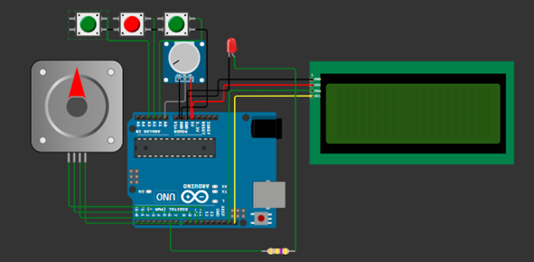
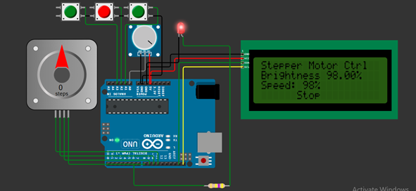
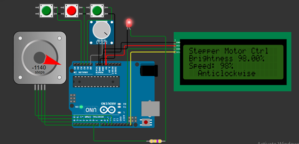

# IoT-based Light Dimmer and Speed Controller

A robust, Arduino-powered IoT system for precise remote control of lighting and motor speed/direction, featuring real-time LCD feedback. Built, tested, and shared using the [Wokwi](https://wokwi.com/) simulator for maximum reproducibility and accessibility.

---

## Overview

This project demonstrates how to design and implement an IoT-based light dimmer and speed controller using Arduino. Users can remotely and precisely adjust both light intensity and motor speed/direction via a physical interface, with all states clearly displayed on an LCD. The modular design makes the solution scalable and adaptable for smart home, industrial, or educational applications.

---

## Online Simulation ([Try it now!](https://wokwi.com/projects/412304916007617537))

This project was fully developed and tested using the [Wokwi online Arduino simulator](https://wokwi.com/), making it easy for anyone to run, share, and experiment with the design—even without real hardware.

- **[Open the project in Wokwi simulator](https://wokwi.com/projects/412304916007617537)**  
- View, run, and modify the simulation instantly online.

---

## Features

- **Remote Control:** Adjust light brightness and motor speed/direction via simple interface.
- **Modular Design:** Separated code for light dimming and speed control.
- **LCD Display:** Real-time feedback for all parameters (brightness %, speed %, motor mode).
- **Energy Efficiency:** Fine-tuned control for optimized energy use.
- **User-Friendly:** Three-button interface for intuitive operation.
- **Cloud Simulation:** Open, run, and share via Wokwi without any hardware.

---

## Hardware Components

- **Arduino Uno** (or compatible)
- **Bipolar Stepper Motor** (e.g., 200 steps/rev)
- **Potentiometer** (linear, for analog input)
- **3 Push Buttons** (Clockwise, Stop, Anticlockwise)
- **LCD Display** (20x4 I2C)
- **LED** (for dimming demo)
- **Resistors** (as needed)
- **Wires & Breadboard**

---

## Circuit Diagram

Add your circuit diagram in the `images/` folder and link it here.

---

## Arduino Code

All code is provided in the [`code/arduino_light_dimmer_speed_controller.ino`](code/arduino_light_dimmer_speed_controller.ino) file.

**Key features:**
- Reads potentiometer value to set both light brightness (PWM) and stepper speed.
- Displays current state (brightness, speed %, motor mode) on LCD.
- Controls stepper direction/speed based on push buttons.
- Modular and fully commented for easy customization.

---

## Getting Started

### 1. **Hardware Setup**
- Connect the potentiometer to analog pin `A0`.
- Connect push buttons to pins `A1`, `A2`, and `A3` (internal pull-ups enabled).
- Connect the LCD (I2C, address `0x27`) to the appropriate I2C pins.
- Connect LED to PWM pin `6` (with resistor).
- Connect the stepper motor to pins `8, 9, 10, 11`.

### 2. **Software Setup**
- Install Arduino IDE.
- Install libraries: `LiquidCrystal_I2C`, `Stepper`
- Load `code/arduino_light_dimmer_speed_controller.ino` into the IDE.
- Upload the code to Arduino Uno.

### 3. **Usage**
- Use potentiometer to set light brightness and motor speed.
- Press **Clockwise** button for forward motion.
- Press **Anticlockwise** for reverse.
- Press **Stop** to halt the motor.
- Observe LCD for all state changes.

---

## Example Output

Add your LCD screenshots and result images in the `images/` folder.

- Light dimmed to 98%  
  
- Motor running Anticlockwise at 98% speed  
  

---
